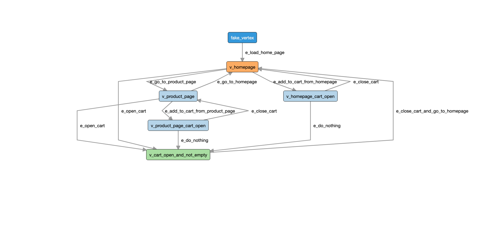

# AltWalker Example: C#/.NET E-commerce

Demo tests to showcase how to design your tests as a graph and execute them using altwalker.

Documentation of the demo is available [here](https://altom.gitlab.io/altwalker/altwalker/examples/dotnet/e-commerce-demo.html).

The site under test is available on gitlab pages [here](https://altom.gitlab.io/altwalker/snipcart-jekyll-ecommerce-demo/).

## Setup

```bash
$ cd dotnet-ecommerce
$ dotnet build tests
```

## Install Dependencies

Altwalker

```bash
$ pip install altwalker
```

See docs for [Altwalker installation](https://altom.gitlab.io/altwalker/altwalker/installation.html).

## Run the tests with AltWalker

Read more [here](https://altom.gitlab.io/altwalker/altwalker/examples/python/e-commerce-demo.html).

### check

```
$ altwalker check -m models/default.json "random(edge_coverage(100) && vertex_coverage(100))"
```

### verify

```
$ altwalker verify -l c# -m models/default.json tests
```

### online

```
$ altwalker online -l c# -m models/default.json "random(edge_coverage(100))" tests
```

### offline and walk

```
$ altwalker offline -m models/default.json "random(edge_coverage(100) && vertex_coverage(100))" -f steps.json
$ altwalker walk -l c# tests ./steps.json
```


## Models

* Navigation Model from `models/navigation.json`



* Checkout Model from `models/checkout.json`


