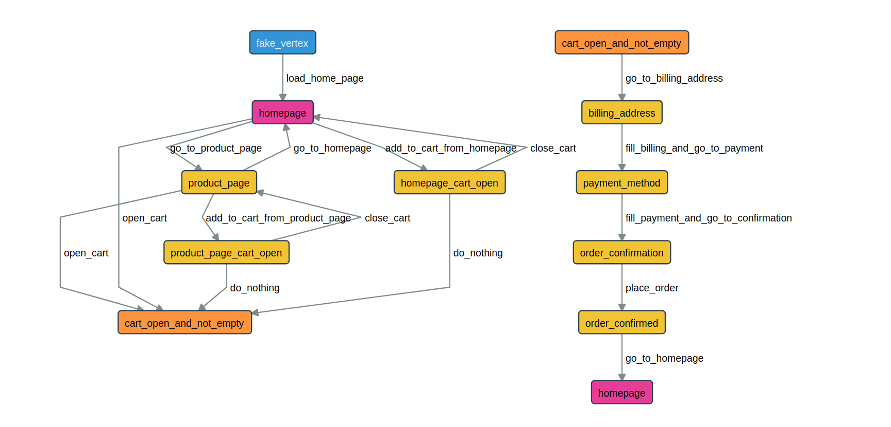

# Altwalker ecommerce example

Altwalker is an open source, Model-based testing framework for automating your test execution. You design your tests as a directional graph and altwalker executes them. It relies on [Graphwalker](http://graphwalker.github.io/) to generate paths through your tests graph.

In this example you will learn how to model your ecommerce website tests as a directional graph, how to use Actions, Guards and Shared State in your graph model. You will learn how to use altwalker's `online`, `offline`, `walk`, `check` and `verify` commands.

The tests in this example are written in python with selenium and to python page object model. The ecommerce website beeing tested is written in markdown and uses jekyll to generate static files. For cart and order management it uses snipcart. 
The website is hosted in [Gitlab Pages](https://gitlab.com/altom/altwalker/snipcart-jekyll-ecommerce-demo) and its forked from [snipcart on github](https://github.com/snipcart/snipcart-jekyll-integration)


## Prerequisites

`python3`
`graphwalker`
`altwalker`

## Setup

```
cd ecommerce-snipcart-jekyll-example
python3 -m venv .virtualenv
source .virtualenv/bin/activate
pip install -r requirements.txt
```

See docs for [Altwalker and graphwalker installation](https://gitlab.com/altom/altwalker/altwalker/tree/master/docs)

## Run tests

### online

`altwalker online -m models/default.json "random(edge_coverage(100))" tests`

Altwalker walks randomly through the graph until all edges have been passed.

- starts graphwalker service on default port 8887.
- initializes graphwalker with `models/default.json` model and `random(edge_coverage(100))` generator stop condition.
- communicates with graphwalker to get next step to be executed
- executes the test in `tests` package associated with the step

---

### offline and walk

`altwalker offline -m models/default.json "random(edge_coverage(100) && vertex_coverage(100))" > steps`

Altwalker generates a valid path throgh the test graph.
- starts graphwalker services and runs offline command to generate a list of valid steps through the graph.

`altwalker walk tests ./steps`
Altwalker walks on the steps in `./steps` file.
- reads steps from file
- executes, in the order from file, the tests in `tests` package associated with each step

---

### check

`altwalker check -m models/default.json "random(edge_coverage(100) && vertex_coverage(100))"`
Checks the integity of the model.
- starts a graphwalker service and runs graphwalker check command
- runs altwalker checks on json models interity

There is currently an [issue](https://github.com/GraphWalker/graphwalker-project/issues/204) with graphwalker check command. It does not correctly detect cul-de-sacs on vertices with 0 outer edges but with shared_state.


### verify

`altwalker verify -m models/default.json  tests`

Altwalker verifies that your model and tests are valid, and that all names referred in the model are implemented in `tests` package


## Model

[models/default.json](models/default.json)
