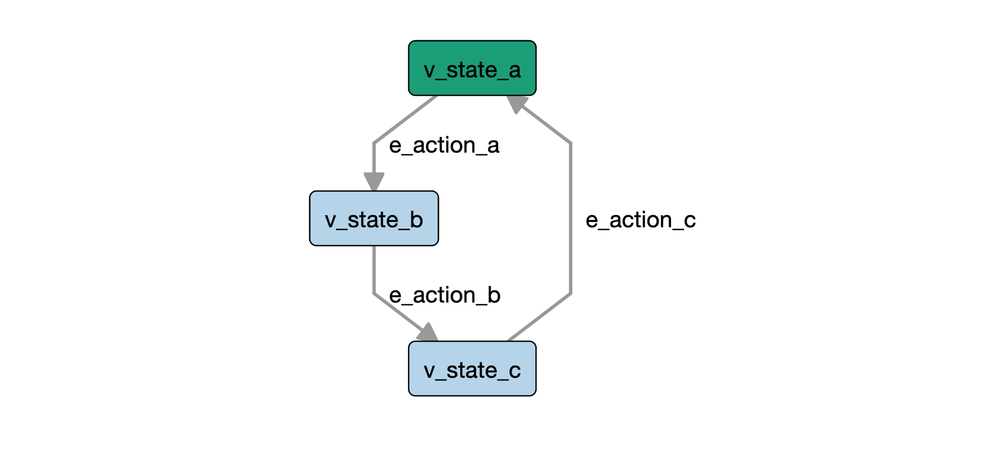

# AltWalker Example: Python Debugger

A simple example that shows how to use the python debugger with AltWalker.

Read more about the pdb [here](https://docs.python.org/3/library/pdb.html).

## Setup

Linux/MacOS:

```bash
$ cd python-debugger
$ python3 -m venv .venv
$ source .venv/bin/activate
$ pip install -r requirements.txt
```

Windows:

```bash
$ cd python-debugger
$ python3 -m venv .venv
$ .venv/Scripts/activate.bat
$ pip install -r requirements.txt
```

Read more about venv [here](https://docs.python.org/3/library/venv.html).

## Run the debugger with AltWalker

Because AltWalker redirects the output of your test methods using `contextlib.redirect_stdout` simply
calling `breakpoint` or `pdb.set_trace` won't work.

AltWalker will intercept the messages from the debugger and you will not be able to see them.

You will need to initialize a debugger class that will use the default `sys.stdout` (the one before the redirect)
as output and call `set_trace` on it.

```python
# test.py

import sys
import pdb


debugger = pdb.Pdb(skip=['altwalker.*'], stdout=sys.stdout)


class ExampleModel:

    # ...

	def element_method(self):
		debugger.set_trace()

    # ...
```

We also set the `skip` argument, so that the debugger will not step into frames that originate in the `altwalker` module.

> The skip argument, if given, must be an iterable of glob-style module name patterns. The debugger will not step into frames that originate in a module that matches one of these patterns.
> - https://docs.python.org/3/library/pdb.html#pdb.Pdb

```bash
$ altwalker online tests -m models/debug.json "random(length(100))"
```

You will see somethig like this:

```
Running:
[2020-01-17 17:24:06.347541] DebugModel.v_state_a Running
[2020-01-17 17:24:06.347959] DebugModel.v_state_a Status: PASSED

[2020-01-17 17:24:06.364014] DebugModel.e_action_a Running
[2020-01-17 17:24:06.364255] DebugModel.e_action_a Status: PASSED

[2020-01-17 17:24:06.381578] DebugModel.v_state_b Running
[2020-01-17 17:24:06.382283] DebugModel.v_state_b Status: PASSED

[2020-01-17 17:24:06.415607] DebugModel.e_action_b Running
[2020-01-17 17:24:06.416030] DebugModel.e_action_b Status: PASSED

[2020-01-17 17:24:06.434449] DebugModel.v_state_c Running
--Return--
> ../altwalker-examples/python-debugger/tests/test.py(18)v_state_c()->None
-> debugger.set_trace()
(Pdb)
```

And now you are in inside the debugger.

## Models

> **Note**: For this example the model is irrelevant.

* Example Model from `models/debug.json`


