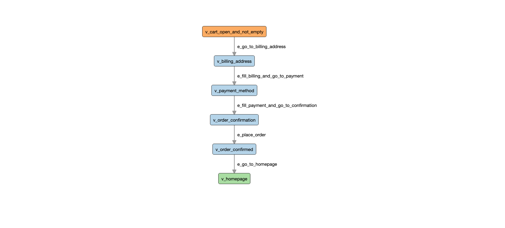

# AltWalker Example: Python E-commerce

Demo tests to showcase how to design your tests as a graph and execute them using AltWalker.

Documentation of the demo is available [here](https://altwalker.github.io/altwalker/examples/python/e-commerce-demo.html).

The site under test is available on GitHub pages [here](https://altwalker.github.io/jekyll-ecommerce/).

## Setup

Linux/MacOS:

```bash
$ cd python-ecommerce
$ python3 -m venv .venv
$ source .venv/bin/activate
$ pip install -r requirements.txt
```

Windows:

```bash
$ cd python-ecommerce
$ python3 -m venv .venv
$ .venv/Scripts/activate.bat
$ pip install -r requirements.txt
```

Read more about venv [here](https://docs.python.org/3/library/venv.html).

### Install Dependencies

Read more on [AltWalker installation](https://altwalker.github.io/altwalker/installation.html).

#### Geckodriver

Download [geckodriver](https://github.com/mozilla/geckodriver/releases).

After you download and extract the executable, make sure you set the path to the geckodriver executable in the Path variable to make other programs aware of its location.

On Windows:

```
$ set PATH=%PATH%;C:\bin\geckodriver
```

On Linux/MacOS:

```
$ ln -s /path/to/geckodriver /usr/local/bin/geckodriver
```

## Run the tests with AltWalker

Read more [here](https://altwalker.github.io/altwalker/examples/python/e-commerce-demo.html).

### check

```
$ altwalker check -m models/navigation.json "random(edge_coverage(100) && vertex_coverage(100))"
```

### verify

```
$ altwalker verify -m models/navigation.json tests
```

### online

```
$ altwalker online -m models/navigation.json "random(edge_coverage(100))" tests
```

### offline and walk

```
$ altwalker offline -m models/navigation.json "random(edge_coverage(100) && vertex_coverage(100))" -f steps.json
$ altwalker walk tests ./steps.json`
```

## Models

* Navigation Model from `models/navigation.json`


* Checkout Model from `models/checkout.json`


